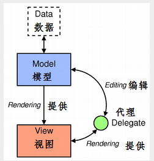
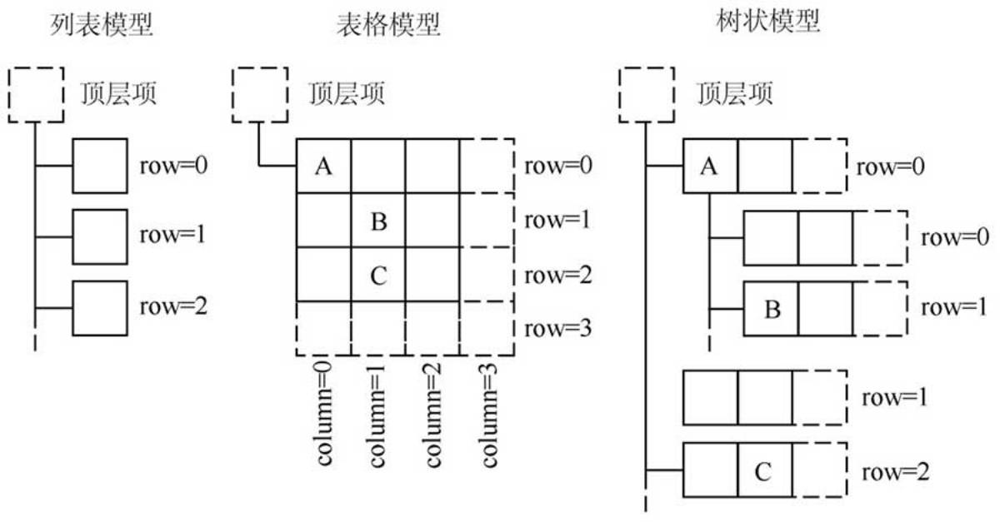
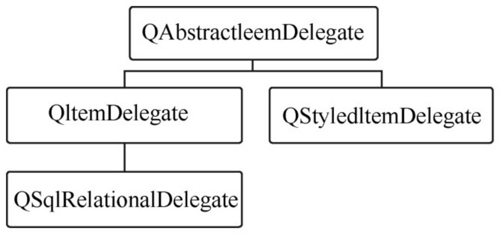
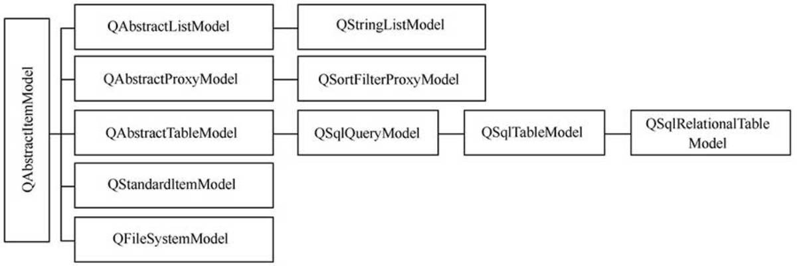
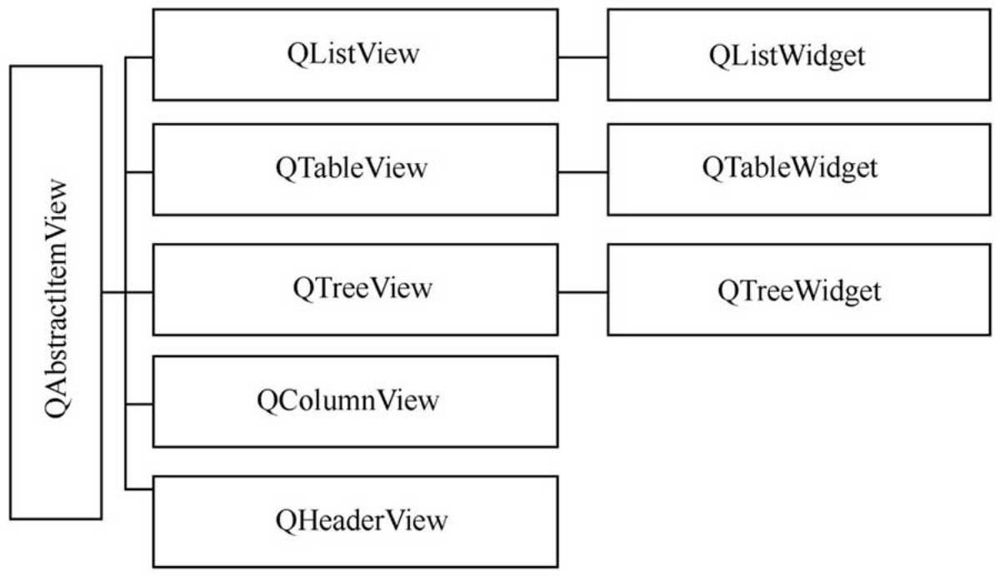
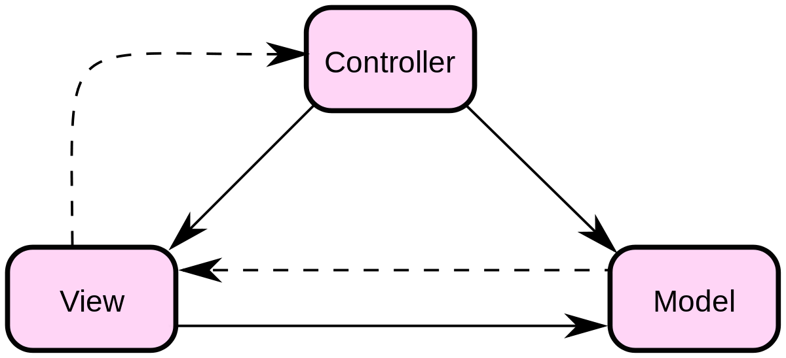

# Qt 中的 Model/View 结构

> 本文摘自[PyQt中的 Model/View 结构 - muzing的杂货铺](https://muzing.top/posts/5ff61cbd/)

## Qt Model/View 编程思想

### Qt文档

[Qt 官方文档-Model/View编程](https://doc.qt.io/qt-6/model-view-programming.html)

### 简介

源数据由模型 (Model) 读取，然后在视图 (View) 组件上显示和编辑，在界面上编辑修改的数据又通过模型保存到源数据。

Model/View 结构将数据模型和用户界面分离开来，分别用不同的实现，是一种显示和编辑数据的有效结构，在处理大型数据时尤其明显。

- Data（源数据）是原始数据，如数据库的一个数据表或SQL查询结果、内存中的一个字符串列表或磁盘文件结构等
- Model（模型/数据模型）与源数据通信，并为视图组件提供数据接口。它从源数据提取需要的数据，用于视图组件进行显示和编辑
- View（视图/视图组件）是界面控件，视图从数据模型中根据一定条件（如行号、列号等）获得模型索引（一个指向数据项的引用），然后显示在界面上
- Delegate（代理）在视图与模型之间交互操作时提供临时编辑组件的功能

由于通过 Model/View 结构将原始数据与显示/编辑界面分离开来，可以将一个数据模型在不同的视图中显示，也可以在不修改数据模型的情况下，设计特殊的视图组件

### 通信机制

模型、视图、代理之间使用信号与槽通信。

- 当源数据发生变化时，数据模型发射信号通知视图组件

- 当用户在界面上操作数据时，视图组件发射信号表示这些操作信息

- 在编辑数据时，代理会发射信号告知数据模型和视图组件编辑器的状态

### 数据模型基本结构

### model index 模型索引

[QModelIndex](https://doc.qt.io/qt-6/qmodelindex.html)是表示模型索引的类。通过数据模型存取的每个数据都有一个模型索引，视图组件和代理都通过索引来获取数据。这样保证了数据的表示与数据存取方式的分离。

模型索引提供数据存取的一个临时指针，用于通过数据模型提取或修改数据。

模型内部组织数据的结构可能随时改变，所以模型索引是临时的。例如，对于一个QTreeView组件，如果获取一个节点的模型索引后又修改了模型数据，则先前获得的模型索引或不再指向原节点。

### 行号和列号

数据模型的基本形式是用行和列定义的表格数据，但这并不意味着底层的数据是用二维数组存储的，“行”与“列”的概念只是为了组件之间交互方便而做的人为规定。

一个模型索引只包含行号和列号。通过行号、列号、父项的模型索引三个参数来获得需要的模型索引。

### 父项

当数据模型是列表或表格模型时，所有数据项的父项就是顶层项

对于树状模型，一个节点（项）有父节点，也可以是其他节点的父节点。故在构建数据项的模型索引时，必须指定正确的行号、列号和父节点

### item role 项的角色

为数据模型的一个项设置数据时，可以为项设置不同角色的数据。

一个项可以有不同角色的数据，对应不同的用途。

数据角色定义在Qt.ItemDataRole枚举中，主要包括以下枚举值

**一般角色：**

| Qt.ItemDataRole   | 值   | 描述                                     |
|-------------------|-----|----------------------------------------|
| Qt.DisplayRole    | 0   | 以文本形式呈现的键数据                            |
| Qt.DecorationRole | 1   | 数据被渲染为图标等装饰(数据为QColor/ QIcon/ QPixmap) |
| Qt.EditRole       | 2   | 编辑器中正在编辑的数据                            |
| Qt.ToolTipRole    | 3   | 工具提示中显示的数据                             |
| Qt.StatusTipRole  | 4   | 状态栏中显示的数据                              |
| Qt.WhatsThisRole  | 5   | "What’s This?"模式下显示的数据                 |
| Qt.SizeHintRole   | 13  | 将会应用到视图的数据项的大小提示                       |

**描述外观和元数据的角色：**

| Qt.ItemDataRole      | 值   | 描述                                    |
|----------------------|-----|---------------------------------------|
| Qt.FontRole          | 6   | 在默认代理中呈现数据时使用的字体(QFont)               |
| Qt.TextAlignmentRole | 7   | 数据项对齐方式，当设置了数据项的对齐格式时有效(Qt.ALignment) |
| Qt.CheckStateRole    | 10  | 获取项目的选中状态(Qt.CheckState)              |

下图是几种常用数据角色的示意图：

### Delegate 代理

代理在视图与模型之间交互操作时提供临时编辑组件的功能。模型向视图提供数据是单向的，一般仅用于显示。当需要在视图上编辑数据时，代理功能会为编辑数据提供一个编辑器，这个编辑器获取模型的数据、接受用户编辑的数据后又提交给模型。

例如在QTableView组件上双击一个单元格编辑数据时，在单元格里就会出现一个QLineEdit组件，这个编辑框就是代理提供的临时编辑器。代理的主要任务就是为视图组件提供代理编辑器。

对于一些特殊的数据编辑需求，例如只允许输入整型数，使用一个QSpinBox作为代理组件更合适；从列表中选择一个数据，使用一个QComboBox作为代理组件更好。这时就需要从QStyledItemDelegate继承创建自定义代理类。

### 自定义代理

不管从QStyledItemDelegate还是QItemDelegate继承设计自定义代理，都必须实现下面的4个方法

- createEditor()  创建用于编辑模型数据的widget组件，如一个QSpinBox或一个QComboBox组件
- setEditorData()  从模型获得数据，供widget组件进行编辑
- setModelData()  将widget上的数据更新到数据模型
- updateEditorGeometry()  用于给widget组件设置合适的大小

## Qt model 类

### QFileSystemModel

为本机的文件系统提供一个数据模型，可用于访问本机的文件系统。

比如和QTreeView视图组件结合使用，可以用目录树的形式显示本机上的文件系统，类似Windows的文件资源管理器。

使用QFileSystemModel提供的接口函数，可以创建目录、删除目录、重命名目录，可以获得文件名称、目录名称、文件大小等参数，可以获得文件的详细信息

### QStringListModel

用于处理字符串列表的数据模型，可以作为QListView的数据模型，在界面上显示和编辑字符串列表。

### QStandardItemModel

以项数据（item data）为基础的标准数据结构模型类，通常与QTableView配合使用，实现通用的二维数据的管理

## Qt view 类

可以参考[PyQt_practice](https://github.com/muziing/PyQt_practice) 下的 [QAbstractItemView](https://github.com/muziing/PyQt_practice/tree/master/46-QAbstractItemView)、[QListView](https://github.com/muziing/PyQt_practice/tree/master/47-QListView)、[QTableView](https://github.com/muziing/PyQt_practice/tree/master/48-QTableView)、[QTreeView](https://github.com/muziing/PyQt_practice/tree/master/49-QTreeView)

- QListView：用于显示单列的列表数据，适用于一维数据的操作
- QTreeView：用于显示树状结构数据，适用于树状结构数据的操作
- QTableView：用于显示表格状数据，适用于二维表格型数据的操作
- QColumnView：用多个QListView显示树状层次结构，树状结构的一层用一个QListView显示
- QHeaderView：提供行表头或列表头的视图组件，如QTableView的行表头和列表头

## MVC

Model、View、Controller，即模型、视图、控制器

“**MVC由三种对象组成。模型Model是应用程序对象，视图View是其屏幕表示，控制器Controller定义用户界面对用户输入的反应方式。在MVC之前，用户界面设计倾向于将这些对象组合在一起。MVC将它们解耦以增加灵活性和重用性。**”

