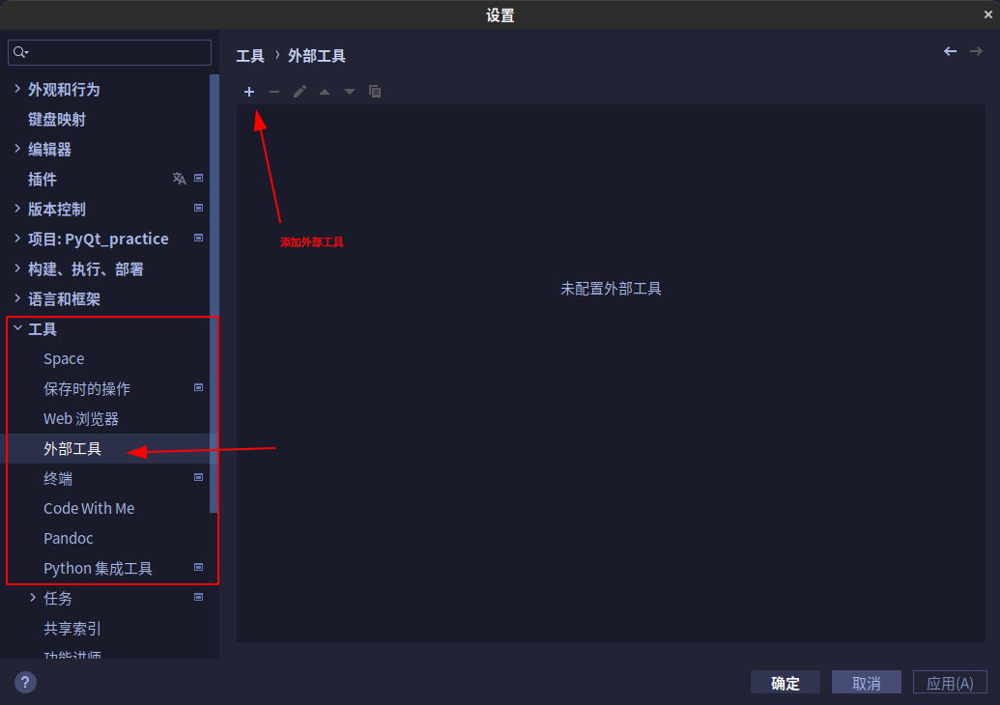
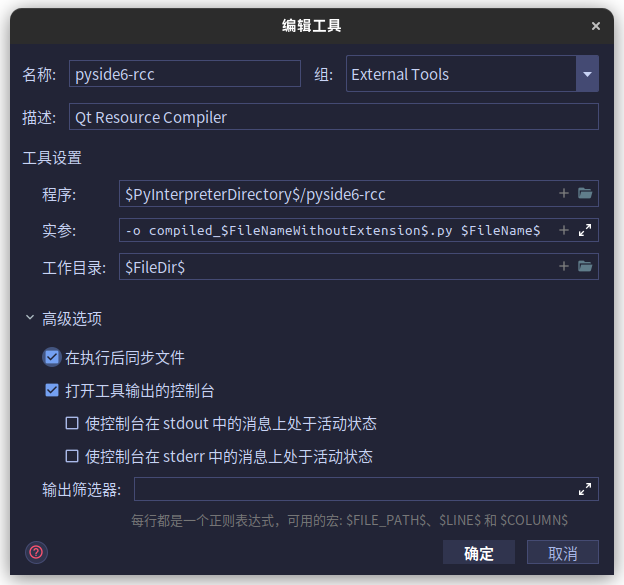
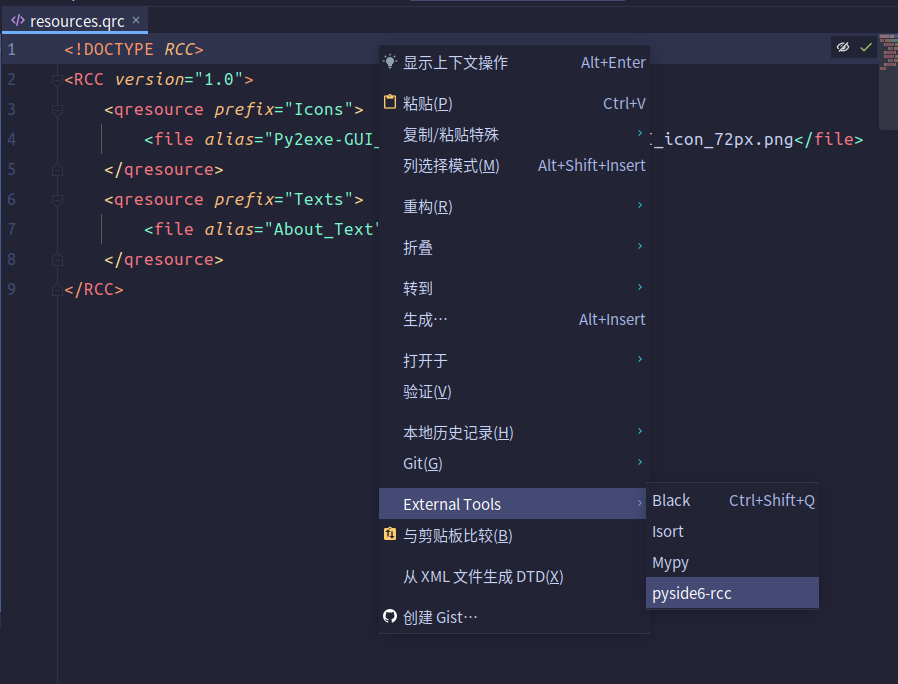
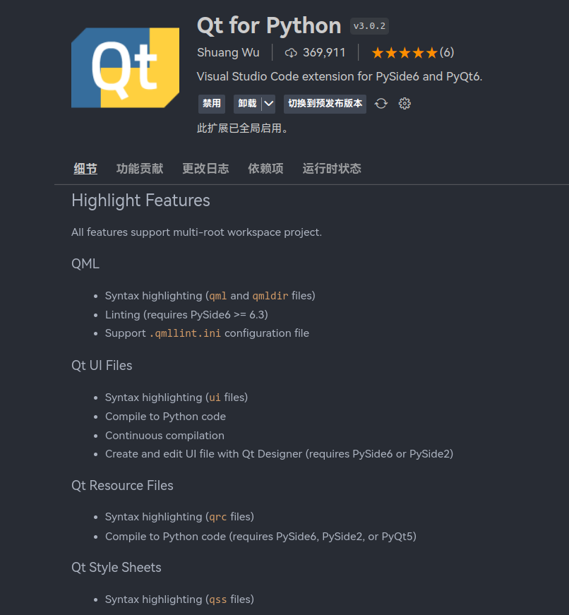
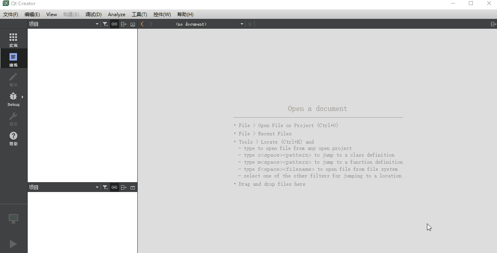
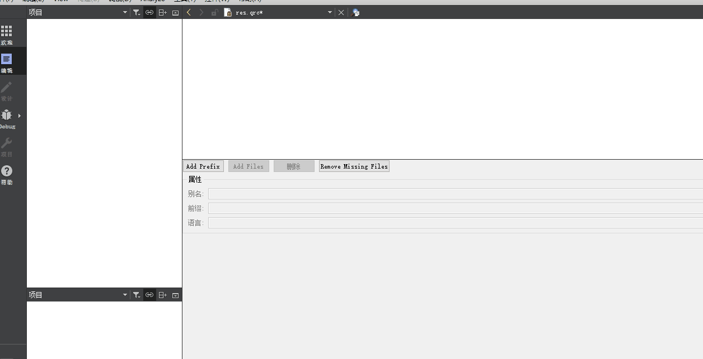
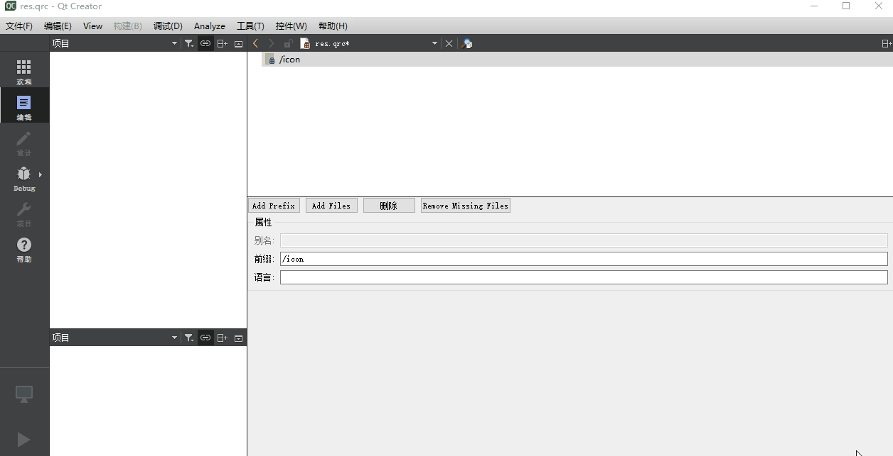
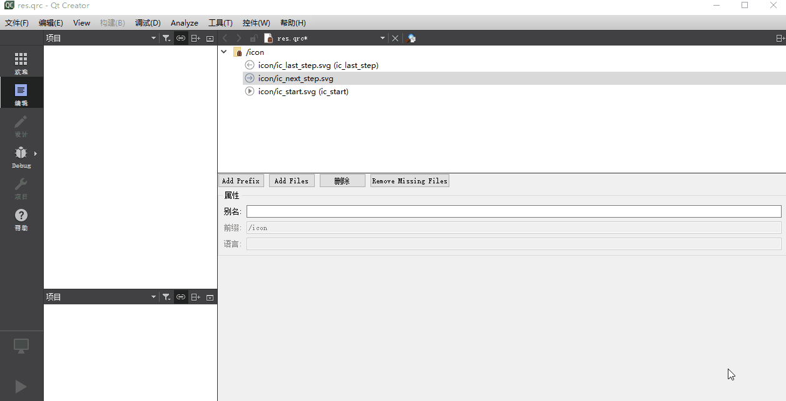

# 在PyQt中使用qrc/rcc资源系统

> 本文摘自[在PyQt中使用qrc/rcc资源系统 - muzing的杂货铺](https://muzing.top/posts/75a2283d/)

## Qt 资源系统简介

Qt 资源系统（[The Qt Resource System](https://doc.qt.io/qt-6/resources.html)）是一种独立于平台的资源管理器，用于在应用程序的可执行文件中存储二进制文件。对 PyQt 而言，这意味着在 Python 代码中直接以二进制形式存储图标、[QSS](https://muzing.top/posts/28a1d80f/)、长文本翻译等资源文件。使用 Qt 资源管理系统可以有效防止资源文件丢失，对于需要打包发布 的 PyQt 程序尤其实用。

在项目中使用 Qt 资源系统，大致分为三个步骤：编写 `.qrc` 文件、使用 rcc 编译资源、导入与使用。下文将一一详细讲解。

## qrc 文件

### 简介与示例

Qt 资源集合文件（Qt Resource Collection File）一般以 `.qrc` 作为扩展名保存，故简称 `.qrc` 文件。其文件格式基于 [XML](https://www.wikiwand.com/en/XML)，用于将文件系统（硬盘）中的资源文件与 Qt 应用程序关联起来。`.qrc` 还可以实现为资源分组、设置别名等功能。

下面是一个简单的例子：

`Resources` 目录下包含图标、关于文档等资源文件。

```shell
$ tree Resources
Resources
├── Icons
│   ├── Py2exe-GUI_icon_72px.png
│   └── Python_128px.png
├── Texts
│   └── About_zh.md
└── resources.qrc
```

在此处新建一个 `resources.qrc` 文件，内容如下：

```xml
<!DOCTYPE RCC>
<RCC>
    <qresource>
        <file>Icons/Py2exe-GUI_icon_72px.png</file>
        <file>Icons/Python_icon.ico</file>
        <file>Texts/About_zh.md</file>
    </qresource>
</RCC>
```

> 注意文件的相对路径是以 `.qrc` 所在的目录 `Resources\` 为根目录开始计算的。

这样便建立了硬盘上文件系统中原文件与 Qt 资源系统中[资源路径](#资源路径)之间的联系。

### 使用前缀进行分组

在文件系统中，可以通过目录对不同类型的资源进行分组。在上面的例子中，图标文件都在 `Icons/` 目录下，而长文本在 `Texts/` 下。在 `.qrc` 中，也可以通过指定 `<qresource>` 标签的 `prefix` 属性来对资源进行分组：

```xml
<!DOCTYPE RCC>
<RCC>
    <qresource prefix="icons">
        <file>Icons/Py2exe-GUI_icon_72px.png</file>
        <file>Icons/Python_icon.ico</file>
    </qresource>
    <qresource prefix="texts">
        <file>Texts/About_zh.md</file>
    </qresource>
</RCC>
```

### 为资源创建别名

有些资源的文件名很长，每次使用时都输入完整文件名较为繁琐。可以通过在 `<file>` 标签中添加 `alias` 属性为其创建别名，方便未来在[资源路径](#资源路径)中使用：

```xml
<!DOCTYPE RCC>
<RCC>
    <qresource prefix="icons">
        <file alias="Py2exe-GUI_icon">Icons/Py2exe-GUI_icon_72px.png</file>
        <file alias="Python_icon">Icons/Python_icon.ico</file>
    </qresource>
    <qresource prefix="texts">
        <file alias="About_Text">Texts/About_zh.md</file>
    </qresource>
</RCC>
```

## 使用 rcc 编译资源

### rcc 简介

Qt 提供了 [Resource Compiler](https://doc.qt.io/qt-6/rcc.html) 命令行工具（简称 rcc），用于在构建过程中将资源嵌入 Qt 应用程序。对于 PyQt，也有对应版本的 rcc 工具，用于将 `.qrc` 中指定的资源文件数据编译至 Python 对象。

### rcc 的安装与基本使用

当通过 `pip` 安装 PySide6 或其他 PyQt 时，会同时自动安装对应版本的 rcc 工具。这些工具的调用命令有所不同（详见下表），但使用方式与功能是一致的。激活已安装 PyQt 的 Python 虚拟环境，在命令行（注意不是 Python 交互式解释器）中输入对应的 rcc 命令即可。

| 平台      | rcc 命令名称      |
|---------|---------------|
| PySide6 | `pyside6-rcc` |
| PyQt5   | `pyrcc5`      |
| PySide2 | `pyside2-rcc` |
| PyQt6   | 不提供           |

> 使用 PySide6 提供的 `pyside6-rcc` 工具编译出的 `.py` 文件，也可以放入 PyQt6 项目中使用，只需将文件开头的 `from PySide6 import QtCore` 替换为 `from PyQt6 import QtCore` 即可。

例如，对于 PySide6，在命令行调用命令

```shell
pyside6-rcc -o compiled_resources.py resources.qrc
```

即可将 `resources.qrc` 中列出的资源文件编译到输出文件 `compiled_resources.py` 中。

### rcc 命令行选项

此处以 pyside6-rcc 6.4.1 为例，列出了完整的选项列表（翻译版）：

```shell
$ pyside6-rcc --help
Usage: /path/to/your/python3/site-packages/PySide6/Qt/libexec/rcc [options] inputs
Qt Resource Compiler version 6.4.1

Options:
  -h, --help                            显示关于命令行选项的帮助
  
  --help-all                            显示包括Qt独有选项在内的所有帮助
  
  -v, --version                         显示版本信息
  
  -o, --output <file>                   将输出写入到 <file> 中，而不是 stdout 中

  -t, --temp <file>                     为大资源文件使用临时文件 <file>
  
  --name <name>                         用 <name> 创建一个外部初始化函数
  
  --root <path>                         用根目录 <path> 作为资源访问路径的前缀
  
  --compress-algo <algo>                使用 <algo> 算法压缩输入文件([zlib], none)
  
  --compress <level>                    按 <level> 级别压缩输入文件
  
  --no-compress                         禁用所有压缩，等同于 --compress-algo=none
  
  --no-zstd                             禁止使用 zstd 压缩
  
  --threshold <level>                   衡量是否值得进行压缩的阈值
  
  --binary                              输出一个作为动态资源使用的二进制文件
  
  -g, --generator <cpp|python|python2>  选择生成器
  
  --pass <number>                       Pass number for big resources
  
  --namespace                           关闭命名空间宏
  
  --verbose                             启用 verbose 模式
  
  --list                                只列出 .qrc 文件条目，不生成代码
  
  --list-mapping                        只输出 .qrc 中定义的资源路径与文件系统路径的
                                        映射，不生成代码
                                        
  -d, --depfile <file>                  向 <file> 中写入一个包含 .qrc 依赖项的 depfile

  --project                             输出一个包含当前目录下所有文件的资源文件
  
  --format-version <number>             写入 RCC 格式的版本

Arguments:
  inputs                                输入文件 (*.qrc)
```

### 编译出的 Python 文件

运行成功后，在 `.qrc` 中声明的所有资源文件都已经被编译到 `compiled_resources.py` 这个 Python 文件中，不妨打开查看其内容：

```python
# 以下为 compiled_resources.py 文件中内容

# Resource object code (Python 3)
# Created by: object code
# Created by: The Resource Compiler for Qt version 6.4.1
# WARNING! All changes made in this file will be lost!

from PySide6 import QtCore

qt_resource_data = b"......"

qt_resource_name = b"......"

qt_resource_struct = b"......"

def qInitResources():
    QtCore.qRegisterResourceData(0x03, qt_resource_struct, qt_resource_name, qt_resource_data)

def qCleanupResources():
    QtCore.qUnregisterResourceData(0x03, qt_resource_struct, qt_resource_name, qt_resource_data)

qInitResources()

```

最上方的注释标明了该文件由与 Qt6.4.1 版本匹配的资源编译器生成。并警告用户不要直接编辑该文件，因为所有修改都会被下一次编译操作覆盖掉。

接下来是三段长长的二进制编码字符串，其中正是资源文件：

- `qt_resource_data` - 资源文件内容数据
- `qt_resource_name` - 资源文件名称
- `qt_resource_struct` - 资源结构

还有两个函数 `qInitResources()` 与 `qCleanupResources()`，分别对应向 Qt 中注册资源与清理资源。

代码的最后一行调用了注册资源函数。

## 在主程序中使用

对于 PyQt 程序，从「直接加载使用资源文件」切换到「使用 Qt 资源系统读取资源」，还需要如下步骤：

1. 在主程序中导入编译后的资源
2. 用「资源路径」替换「文件路径」
3. 由使用 Python 内置 `open()` 函数改为使用 Qt 中 [QFile](https://doc.qt.io/qt-6/qfile.html) 类或 [QDir](https://doc.qt.io/qt-6/qdir.html) 类提供的 `open()` 方法

### 导入编译后的资源

在主程序中添加 import 导入语句，将刚才获得的 `compiled_resources.py` 导入：

```python
import compiled_resources  # type: ignore
```

因为 import 的过程会执行该模块中的所有代码，也就自动调用了 `qInitResources()` 函数，完成了资源的注册与加载。

> PyCharm 等 IDE 可能将此行代码判断为 “未使用的 import 语句” 而提示一个弱警告。可以通过在该行末尾添加特殊的 `# type: ignore` 注释来显式告知静态检查器忽略此行，消除这种不必要的警告。

### 资源路径

对于直接使用资源原文件，会使用其在文件系统中的路径，例如

```python
icon = QPixmap("Icons/Python_icon.ico")
```

而在 Qt 资源系统中使用，则需要将文件路径替换为「资源路径」。资源路径由 `.qrc` 文件决定。

对于最一般的情况，直接在文件名前添加 `:/` 即可得到其资源路径：

```xml
<qresource>
    <file>Icons/Python_icon.ico</file>
</qresource>
```

```python
icon = QPixmap(":/Python_icon.ico")
```

对于有前缀进行分组的，则需要在文件名前添加 `:/$prefix$/`作为资源路径：

```xml
<qresource prefix="icons">
    <file>Icons/Python_icon.ico</file>
</qresource>
```

```python
icon = QPixmap(":/icons/Python_icon.ico")
```

对于指定了别名的，可以直接使用别名：

```xml
<qresource prefix="icons">
    <file alias="Py_ico">Icons/Python_icon.ico</file>
</qresource>
```

```python
icon = QPixmap(":/icons/Py_ico")
```

### 读取资源文件

需要使用 Qt 提供的 [QFile](https://doc.qt.io/qt-6/qfile.html) 或 [QDir](https://doc.qt.io/qt-6/qdir.html) 读取编译后的资源文件，而不再能使用 Python 提供的 `open()` 函数等。

例如，一段从 Markdown 文件中读取应用程序“关于”文本的代码，使用直接读取原资源文件的写法如下：

```python
def get_about_text():
    about_file = open("Resources/About.md", "r", encoding="utf-8")  # 调用Python内置的open()
    about_text = about_file.read()
    about_file.close()
    return about_text
```

而使用 Qt 资源系统后，需要修改为如下形式：

```python
from PySide6.QtCore import QFile, QIODevice

def get_about_text():
    # 使用Qt风格读取文本文件
    about_file = QFile(":/texts/About_Text")  # 使用Qt中的QFile类
    about_file.open(QIODevice.ReadOnly | QIODevice.Text)  # 打开文件
    about_text = str(about_file.readAll(), encoding="utf-8")  # 读取文件，并将 QBtyeArray 转为 str
    about_file.close()
    return about_text
```

对于图片，可以在创建 [QIcon](https://doc.qt.io/qt-6/qicon.html)、[QImage](https://doc.qt.io/qt-6/qimage.html)、[QPixmap](https://doc.qt.io/qt-6/qpixmap.html) 对象时将直接资源路径作为参数传入：

```python
icon = QPixmap(":/icons/Python_icon.ico")
```

## 在 IDE 中配置

### 在 PyCharm 中配置使用 rcc

可以将 rcc 工具添加至 PyCharm 中，避免每次使用都需要输入繁琐的命令行。（目前版本的 PyCharm 中已经原生内置了对 `pyrcc4` 和 `pyside-rcc` 的支持，但其他版本的 rcc 工具快捷使用仍需自行在「外部工具」中创建。）

打开 文件 -> 设置 -> 工具 -> 外部工具（File -> Settings -> Tools -> External Tools）



然后创建工具。配置可以参考下图，仍然以 `pyside6-rcc` 为例：



其中比较重要的是「工具设置」里面的三行配置：

```text
程序：        $PyInterpreterDirectory$/pyside6-rcc
实参：        -o compiled_$FileNameWithoutExtension$.py $FileName$
工作目录：     $FileDir$
```

其中凡是以一对 `$` 包裹的字符，均为 PyCharm 提供的宏，分别代表「Python 解释器目录」、「不带扩展名的文件名」、「文件名」和「文件所在目录」。

完成配置后，在待编译的 `.qrc` 文件上打开右键菜单，找到「外部工具 - pyside6-rcc」，点击即可运行，非常方便。



### 使用 VS Code 编辑 qrc

安装 [Qt for Python](https://marketplace.visualstudio.com/items?itemName=seanwu.vscode-qt-for-python) 插件后，VS Code 编辑器会对 `.qrc` 文件提供一定的语法高亮、亦可一键编译。

```shell
# VS Code 插件安装命令：
ext install seanwu.vscode-qt-for-python
```



### 使用 QtCreator 编辑 qrc

> 此小节参考自 <https://blog.csdn.net/anbuqi/article/details/120455219>。

直接在文本编辑器中以 XML 形式编写复杂的 `.qrc` 文件时，较为繁琐、易出错，可以考虑安装 Qt 官方的 [QtCreater](https://www.qt.io/product/development-tools) IDE 来生成 `.qrc` 文件。

```shell
$ tree resource
resource
├── icon
│   ├── ic_last_step.svg
│   ├── ic_next_step.svg
│   └── ic_start.svg
└── res.qrc
```

首先启动 QtCreater，在 `resource/` 目录中新建 `res.qrc` 文件：



然后以 icon 前缀创建一个分组：



接着用 Add Files 按钮把图标文件添加进来，并保存：



此时得到了 `res.qrc`：

```xml
<RCC>
    <qresource prefix="/icon">
        <file>icon/ic_last_step.svg</file>
        <file>icon/ic_next_step.svg</file>
        <file>icon/ic_start.svg</file>
    </qresource>
</RCC>
```

为了缩短引用路径，还可以为每个图标文件设置别名（alias）：



现在得到这样的 `res.qrc`：

```xml
<RCC>
    <qresource prefix="/icon">
        <file alias="ic_last_step">icon/ic_last_step.svg</file>
        <file alias="ic_next_step">icon/ic_next_step.svg</file>
        <file alias="ic_start">icon/ic_start.svg</file>
    </qresource>
</RCC>
```

## 进阶话题

### 国际化多语言

有时应用程序需要在不同的语言环境下使用不同的文件，可以通过设置 `lang` 属性来轻松实现。下面是一个例子：

```xml
<qresource>
    <file>cut.jpg</file>
</qresource>
<qresource lang="fr">
    <file alias="cut.jpg">cut_fr.jpg</file>
</qresource>
```

当系统语言为其他语言时，Qt 程序将会使用文件 `cut.jpg`；而当系统语言为法语时，会自动替换为 `cut_fr.jpg`。

### 压缩

rcc 会尝试压缩内容以优化硬盘空间使用。默认情况下，它将进行启发式检查以确认是否值得压缩。如果不能充分压缩，则将直接存储非压缩的内容。可以使用 `-threshold` [选项](#rcc-命令行选项)控制此判断的阈值。例如，默认情况下阈值为 70，表示只有在压缩后的文件比原文件小 70%（不超过原文件大小的 30%）时才有必要压缩。

```shell
rcc -threshold 25 myresources.qrc
```

在某些情况下也可以关闭压缩功能。一种常见情况是，某些资源已经是压缩后的格式（例如 `.png` 文件），再次压缩几乎不会进一步减小文件体积，但会占用 CPU 成本。另一种情况是，硬盘空间非常充裕，期望应用程序在运行时可以将内容存储在干净的内存页中。在[命令行](#rcc-命令行选项)中添加 `-no-compress` 命令以关闭压缩。

```shell
rcc -no-compress myresources.qrc
```

还可以控制 rcc 使用的压缩算法与压缩级别，例如：

```shell
rcc -compress 2 -compress-algo zlib myresources.qrc
```

表示使用 zlib 压缩算法，压缩等级为 2。

除了在命令行调用 rcc 时指定选项，还可以在 `.qrc` 文件中控制阈值、压缩算法与压缩等级：

```xml
<qresource>
    <file compress="1" compress-algo="zstd">data.txt</file>
</qresource>
```

rcc 具体支持的压缩算法类型与压缩等级，参见[官方文档](https://doc.qt.io/qt-6/resources.html#compression)。

## 参考资料

1. [Qt6 官方文档：The Qt Resource System](https://doc.qt.io/qt-6/resources.html)
2. [Qt6 官方文档：Resource Compiler (rcc)](https://doc.qt.io/qt-6/rcc.html)
3. [Qt for Python 官方教程：Using .qrc Files (pyside6-rcc)](https://doc.qt.io/qtforpython/tutorials/basictutorial/qrcfiles.html)
4. [pyside6(1):Qt 资源系统和qrc文件使用](https://blog.csdn.net/anbuqi/article/details/120455219)
5. [Stack Overflow: How can resources be provided in PyQt6 (which has no pyrcc)?](https://stackoverflow.com/questions/66099225)
